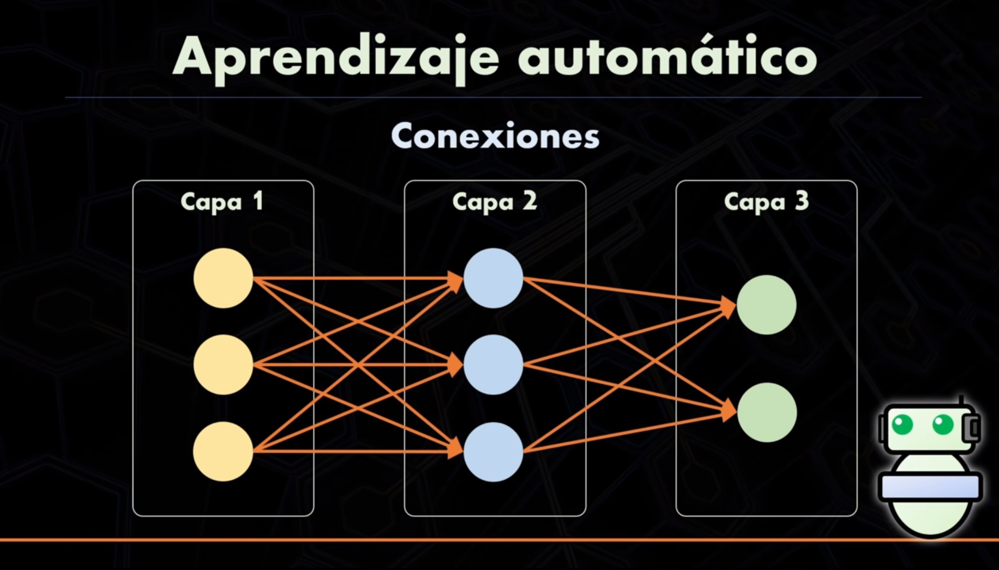

# Practica Tensorflow Prediccion de temperatura

## Creacion de una red neuronal con Python y Tensorflow
Es solo una demostracion del uso de redes neuronales con Python y Tensofrlow

En el aprendizaje automatico contamos con las entradas, es decir con los valores iniciales, con los resultado finales, pero NO CONOCEMOS COMO LLEGAR DE UN PUNTO A OTRO. Dicho de otra manera es como tener numeros (valores iniciales) y los correspondientes resultados a esos numeros (valores finales) y no sepamos cuales fueron las operacion que sucedieron en el medio para que se llegue del punto A al punto B.

Se busca encontrar un modelo que pueda encontrar por si solo el algoritmo que tome las entradas y de los resultados finales.

En programacion regular lo que hariamos es definir tal vez una funcion que tome los valores de entrada y me de los valores finales, pero en aprendizaje automatico solo le daremos al sistema los valores de entrada y los valores finales para que el decida cual es el algoritmo que mejor se ajusta.

## Metodo de resolucion del problema

La resolucion sera utilizando la libreria Tensorflow.

### Tener en cuenta instalar las siguientes librerias:

- [Numpy](https://numpy.org/).
- [Tenssorflow](https://www.tensorflow.org/install).
- [Matplotlib](https://matplotlib.org/).

Las mismas tambien se pueden buscar y descargar desde [pypi.org](https://pypi.org/).

## Algunas capturas de imagenes del proyecto:

### Capas y neuronas

### Conexiones

### Proceso general

# NOTA IMPORTANTE
El siguiente ejercicio fue realizado en base a un video de youtube del canal "Ringa Tech"

enlace en youtube: https://www.youtube.com/watch?v=iX_on3VxZzk&ab_channel=RingaTech
